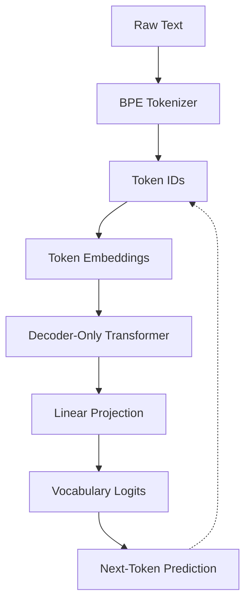

<h1 align="center">ARCH</h1>

<p align="center">
  
  
  
  
</p>

> Experimental decoder-only Transformer for studying autoregressive language modeling and text generation.

<br>

## Abstract

**Arch** is an experimental implementation of a small autoregressive language model based on the Transformer architecture.

The project explores the construction of a language model from its fundamental components, including subword tokenization, token embeddings, causal self-attention, decoder blocks, optimization, autoregressive training, and text generation.

The implementation is intentionally kept small and explicit. Rather than providing a high-level abstraction over an existing language model, Arch exposes the main components of the training and inference pipeline so that they can be inspected, modified, and evaluated independently.

The architecture is inspired by:

> Vaswani et al. — *Attention Is All You Need* (2017)

Arch is not intended to reproduce the original Transformer architecture or any existing language model implementation. It uses the underlying Transformer principles as the basis for a decoder-only autoregressive model.

<br>

## Research Scope

The current implementation investigates the following components:

* Byte Pair Encoding (BPE)
* Autoregressive language modeling
* Decoder-only Transformer architecture
* Multi-head self-attention
* Causal masking
* Feed-forward networks
* Layer normalization
* Next-token prediction
* Masked training objectives
* Noam learning-rate scheduling
* Autoregressive decoding
* Greedy decoding
* Nucleus (top-p) sampling
* Temperature scaling

The current work focuses on **base language-model training**.

No reinforcement learning from human feedback (RLHF), instruction tuning, preference optimization, or conversational alignment is part of the current experimental setup.

<br>

## Model Architecture

The model follows a decoder-only Transformer pipeline.



The dashed connection represents the autoregressive generation process: the predicted token becomes part of the context used to predict the following token.

<br>

## Methodology

The implementation is divided into four main stages.

### 1. Tokenization

Raw text is transformed into subword units using Byte Pair Encoding.

The tokenizer produces integer token identifiers, which are subsequently mapped into the model's embedding space.

### 2. Training

Training follows the standard autoregressive language-modeling objective.

Given a sequence:

```text
x₁, x₂, x₃, ..., xₙ
```

the model is trained to estimate:

$$
P(x_t \mid x_1, ..., x_{t-1})
$$

for each position $t$.

Causal masks prevent a token from attending to future positions during training.

### 3. Optimization

The current implementation uses the Noam learning-rate schedule, originally introduced alongside the Transformer architecture.

Training metrics include masked loss and masked accuracy, allowing padding positions to be excluded from metric computation.

### 4. Generation

After training, the model can generate text autoregressively using different decoding strategies.

Current strategies include:

* Greedy decoding
* Top-p / nucleus sampling
* Temperature scaling

<br>

## Implementation

The repository separates the model implementation from experiment configuration and generated artifacts.

```text
Arch/
├── project/
│   ├── src/
│   │   └── model/
│   │       ├── bpe.py
│   │       ├── dataset.py
│   │       ├── inference.py
│   │       ├── layers.py
│   │       ├── masking.py
│   │       ├── metrics.py
│   │       ├── noam.py
│   │       ├── trainer.py
│   │       └── transformer.py
│   │
│   ├── data/
│   │   └── 001_dataset.jsonl
│   │
│   ├── artifacts/
│   │   ├── model.keras
│   │   └── vocab.json
│   │
│   ├── api.py
│   └── config.yaml
│
├── LICENSE
└── README.md
```

The `src/model` directory contains the implementation of the model and its supporting components.

Experiment configurations are kept independently so that changes to the architecture or training procedure can be evaluated without overwriting previous experimental settings.

<br>

## Evaluation

Evaluation is currently focused on the behavior of the language model during training and generation.

The baseline tracks:

* Masked training loss
* Masked accuracy
* Generated samples
* Decoding behavior under different sampling parameters

Future experiments may introduce additional evaluation criteria, including perplexity, ablation studies, and comparisons between architectural configurations.

<br>

## Results

Results are recorded on a per-experiment basis.

At the current stage, the repository primarily establishes the baseline implementation and experimental infrastructure. Quantitative comparisons between different model configurations will be added as subsequent experiments are conducted.

<br>

## Limitations

The current implementation is intentionally small and experimental.

Its limitations include:

* Limited training data
* Relatively small model capacity
* Limited computational budget
* No instruction tuning
* No RLHF or preference optimization
* Limited evaluation benchmarks
* No comparison against large-scale pretrained language models

Consequently, generated text should be interpreted as an observation of the experimental system rather than as evidence of competitive language-model performance.

<br>

## References

Vaswani, A. et al. (2017).

*Attention Is All You Need.*

Sennrich, R., Haddow, B., & Birch, A. (2016).

*Neural Machine Translation of Rare Words with Subword Units.*

<br>

## License

This project is licensed under the MIT License.
